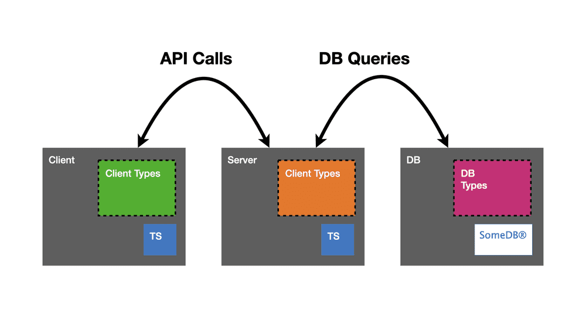
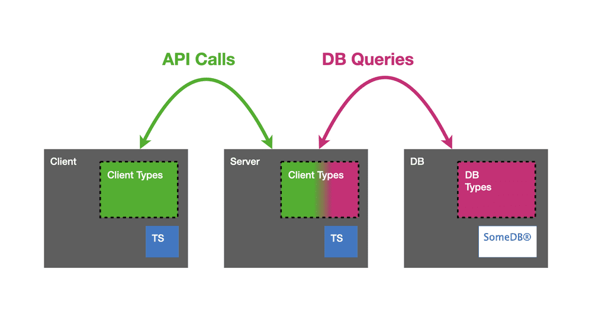
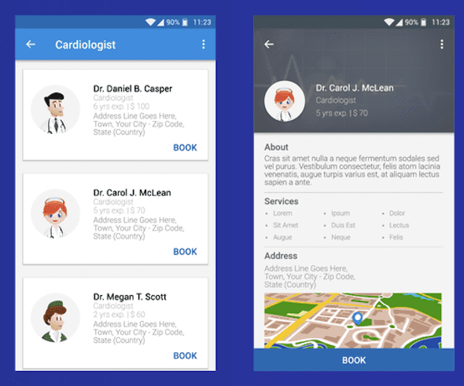

# Frontend Master Fullstack Typescript (Feat. GraphQL and Node.js)

> This course is more focused on the compatibility between GraphQL and
> typescript, and how we can get the benefit of everything working together.

Typescript offers a great authoring experience where we catch the bugs at
build time before they effect a single user.

One of the things that we don't have yet in a setup like this, is the ability
to get the benefit of type checking across an API call.

Anytime we fetch a data and we get a response back, we find ourself having to
assert that, let's say we expect this payload to be a particular type, and
there's nothing that makes sure that all of that stays in alignment except
our own vigilance as a human being.

Here's the illustration for "no type checking on API call" above:<br>


In this course, we are going to try to create a system that looks like
this:<br>


> From the image above, the green color represent one set of types that are
> shared across the client and server. And then another set of types, which is
> the purple color, represent how data is actually persisted in our database.

## The Scenario

The scenario we are going to explore today involves:
- Using typescript for all our client and server side code.
- Using GraphQL for API query language and our wire format (the way we
  construct our json as it travels over the network).
- Using a very simple relational database which based off of a json file.

## GraphQL

Before we get into the project, let's talk a little bit about what GraphQL is
and what problems it aims to solve.

Let's imagine we are building a new page for an existing app. Let's take a
look at the image below:<br>


Imagine we already have the screen on the right and we are being ask to build
something like the screen on the left.

We may already have an API endpoint that produces a lot of detailed
information to power the screen on the right. But, we may need some different
things for the screen on the left, maybe some field that does not exist yet.
For example, what if we want to enable and disable the `BOOK` button from the
screen on the left based on the doctor's current schedule?

We have a couple of choices how we want to proceed if we want to go and do
this with a REST API:
1. Use the existing endpoint as-is and add this availability field. If this
   involve talking to some calender system, which could take a while, this
   means everything that asking information about the doctor, gets a little
   bit slower.

2. Build an entirely new endpoints that produces data only for this
   availability field and we could ask for the existing doctor information
   and the availability information in parallel. This will result in a lot of
   little fragmented supplemental API resources and it's gonna be very
   difficult to keep everything organized over a long period of time.

3. Build an entirely new API endpoints that give everything we need for this
   availability scenario we need to handle. This is gonna result in a lot of
   duplicate code where we will have doctor detail view, doctor summary view,
   etc.

4. Modify the existing endpoint so that it produces a different response
   depending on a query parameter that we pass in. For example, providing a
   query parameter that tells the API whether to produce a summary or a
   details view which may involve different fields for each. This is going to
   become difficult to manage at scale, especially if we don't establish a
   strong convention across all of the resources we have to manage. What does
   the summary mean? What does details mean? In addition, if we have multiple
   different options that all can influence each other as new scenarios that
   need to be handled, we can see how we end up having to worry about a lot of
   different combinations of things and how they interact with each other.

GraphQL aims to solve a problem like this availability scenario. The client
can ask the data that it needs and we can avoid problems like over fetching by
producing only the data that the client asked for and no more.

## Prerequisite

Change directory to the `hands-on` directory, and then run the following
command (only the first time):
```sh
yarn
yarn build
yarn dev
```

`yarn` to install the node package, `yarn build` to build the app for the
first time, and `yarn dev` to start the server.

## Setup Apollo Server

First, copy the snippet from [course website](https://www.typescript-training.com/course/full-stack-typescript/04-hello-apollo/) into the `server/src/apollo-server.ts`.
We will be using those snippet as reference for this section.

If we see the snippet from before, there's `typeDefs`, that is the types that
will be going over the wire over our network which is across API calls.

`typeDefs` is equivalent to a set of interfaces in typescript world.

In `typeDefs` there's also `type Query`. **`Query` is special in the GraphQL
world**, which is some kind of entry point when we are asking for data.
**We can think of `Query` in GraphQL world as our get request in REST API
world**.

**There is no concept of tuple in GraphQL**, so if we see something like this:
```typescript
suggestions: [Suggestion]
```

that is how GraphQL represents array.

**By default, things are optional in GraphQL world**. And optional in here
means they are nullable fields, the value could be `null`. **An exclamation
mark (!) is the way to declare something non-nullable**.

> If we give and exclamation mark (!) inside an array like this `[Suggestion!]`
> that means that we won't find null within the array. Now, if there's an
> exclamation mark (!) outside an array like this `[Suggestion]!` that means we
> need to get an array back. So, it's about whether a members of the array can
> be null or not, versus the array itself can be null or not.
>
> But, we can still have *empty array* that contains no `null` which meet this
> requirements `[Suggestion!]!`.

## Resolver

In order to actually give GraphQL some data to emit, we need to create
something called a *resolver*. The job of resolver is effectively to gather
things together, maybe reads the equivalent of path params or query params or
read things that are part of the request coming in. And then, **it produces
pieces of data that are organized into the response**.

> If we have ever used something like redux, we can think of these like a
> reducer where we have these little subparts that handle a little piece of
> state, but then the way everything is organized together done at a higher
> level.

### Typed Resolver

After we make a resolver, we can generate typescript code based on the GraphQL
schema for the type checking of the resolver.

To generate typescript code, we can use this command:
```sh
yarn codegen
```

> We will run those command in `hands-on/server` directory.

## Operations

The word operations is often used to describe queries that are defined in our
code base where we are either fetching data or we are mutating data, but these
are things that our API consumer is performing.

## Mutation

If we think about mutation in terms of REST API world, mutation would be
equivalent to POST, PUT, and DELETE request which is things that actually
write data into a database.

> Like `Query`, mutation is a top level collections of resolvers.

## Extra Notes

### Query and Mutation in GraphQL

When we say queries in GraphQL, it means we are fetching data. And if we say
mutation, it means we are changing or destroying data.

### Idempotency

The idea of *idempotency* is effectively performing an operation more than
once with the same input will turn out to be no output.

### Input Type

We can think of this as a reusable object type that we might refer to in
variables for our mutation or query. We never querying this and getting a
result back that looks like this, it's for variables only.

### The Triple Dot Symbol

If we see triple dot like this:
```typescriptreact
trends {
  ... on TopicTrend {
    tweetCount
    topic
    quote {
      title
      imageUrl
      description
    }
  }
  ... on HashtagTrend {
    tweetCount
    hashtag
  }
}
```

That is basically telling GraphQL what to do in the case that a member matches
one of those two types. And within the braces, we get the opportunity to
describe the fields we are interested in on a per member basis.

## References

- [Frontend master course](https://frontendmasters.com/courses/fullstack-typescript/).
- [Course website](https://www.typescript-training.com/course/full-stack-typescript).
- [Course github repo](https://github.com/mike-north/full-stack-ts).
- [GraphQL code generator](https://www.graphql-code-generator.com/).
